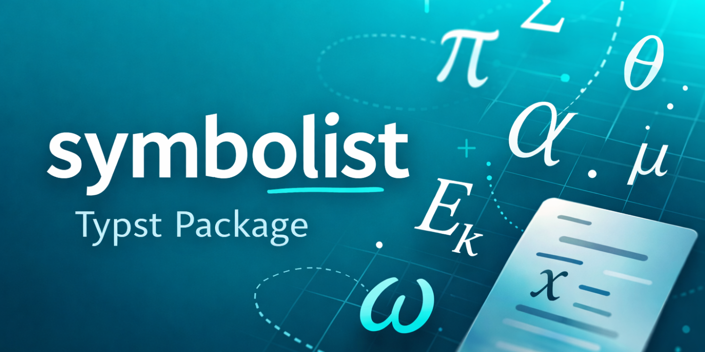
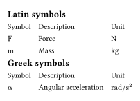

# The symbolist Package

Symbolist is a Typst package that helps generate an organized list of mathematical symbols for your document. Pass any math formula directly — including symbols with subscripts, superscripts, and other notation like `$E_k$`, `$v_"max"$`, or `$hat(x)$` — and Symbolist extracts the base letter to sort everything alphabetically. Latin and Greek symbols are separated into their own tables automatically.

## Getting Started

Import the package and start defining symbols throughout your document. At the end, generate a formatted table of all symbols with their descriptions and units.

```typ
#import "@preview/symbolist:0.2.0": *

// Define symbols as you use them
#def-symbol($F$, "Force", unit: "N")
#def-symbol($m$, "Mass", unit: "kg")
#def-symbol($alpha$, "Angular acceleration", unit: "rad/s²")

// Print the symbol list
#print-symbols()
```



### Installation

To use this package in your Typst document, simply import it from the Typst package repository:

```typ
#import "@preview/symbolist:0.2.0": *
```

For local development:

1. Clone this repository to your local machine
2. Place the package files in your Typst local packages directory:
   - **Linux/macOS**: `~/.local/share/typst/packages/local/symbolist/0.2.0/`
   - **Windows**: `%APPDATA%\typst\packages\local\symbolist\0.2.0\`
3. Import using the local namespace:
   ```typ
   #import "@local/symbolist:0.2.0": *
   ```

For more information on local packages, see the [Typst package documentation](https://github.com/typst/packages).

## Usage

### Basic Usage

Define symbols anywhere in your document using `def-symbol()`:

```typ
#import "@preview/symbolist:0.2.0": *

= Introduction
The force $F$ acting on a mass $m$ produces acceleration $a$.

#def-symbol($F$, "Force", unit: "N")
#def-symbol($m$, "Mass", unit: "kg")
#def-symbol($a$, "Acceleration", unit: "m/s²")
```

### Function Reference

#### `def-symbol(symbol, description, unit: none)`

Defines a symbol with its description and optional unit.

**Parameters:**
- `symbol` (content): The mathematical symbol (e.g., `$F$`, `$alpha$`)
- `description` (string): Description of what the symbol represents
- `unit` (string, optional): Physical unit for the symbol (e.g., "m/s", "kg")

**Example:**
```typ
#def-symbol($v$, "Velocity", unit: "m/s")
#def-symbol($theta$, "Angle", unit: "rad")
#def-symbol($n$, "Number of samples") // No unit
```

#### `print-symbols(level: 2, print-units: true, print-header: true, upright: true, numbering: auto, ..table-args)`

Generates formatted tables of all defined symbols. Symbols are automatically:
- Separated into Latin and Greek categories
- Sorted alphabetically (Greek symbols sorted by Latin equivalent)
- Displayed with their descriptions and units

Sections with no symbols are omitted entirely.

**Parameters:**
- `level` (integer, default: `2`): The heading level used for the "Latin symbols" and "Greek symbols" section titles. Set this to slot the symbol tables into your document's heading hierarchy (e.g. `level: 1` to use the same size as your top-level chapter headings).
- `print-units` (boolean, default: `true`): Whether to include the units column in the table
- `print-header` (boolean, default: `true`): Whether to include table headers (Symbol, Description, Unit)
- `upright` (boolean, default: `true`): Whether the symbols are rendered in upright (roman) math style. Set to `false` to keep the default italic math rendering of variables (`$A_t$` stays italic). Units are always rendered upright. \
  **Why you might want `upright: false`:** ISO 80000-2 and most physics/engineering style guides reserve upright type for *units* and italic for *variables*. Mixing the two collapses useful distinctions — for example, with the default `upright: true`, the symbol for *mass* `$m$` renders as `m` and is visually indistinguishable from the unit symbol for *metre* (`m`) in the Unit column, so a row like `m | Mass | kg` reads ambiguously next to a row like `L | Length | m`. Setting `upright: false` keeps mass as italic *m* against the upright meter `m`, restoring the visual cue.
- `numbering` (any, default: `auto`): Numbering value forwarded to the section-title `heading(...)` calls. With the default `auto` the headings inherit whatever `set heading(numbering: ...)` is in effect in the surrounding document (existing behaviour). Pass `numbering: none` to suppress the numbering even when the rest of the document is numbered — useful when the symbol list lives in front matter and you don't want it counted as a numbered section. Any other value accepted by `heading.numbering` (a pattern string like `"1."` or a function) is forwarded verbatim.
- `..table-args`: Any additional named arguments are forwarded to the underlying `table` elements, letting you override defaults like `fill`, `align`, `inset`, `column-gutter`, etc.

**Examples:**
```typ
// Default: show units and headers, titles at level 2, upright symbols
#print-symbols()

// Render the section titles as level-1 headings
#print-symbols(level: 1)

// Keep symbols in italic math style (e.g. for physics conventions)
#print-symbols(upright: false)

// Suppress section-title numbering (e.g. when the rest of the
// document uses `set heading(numbering: "1.")` but you want
// the symbol list to render as an unnumbered front-matter
// section).
#print-symbols(numbering: none)

// Hide the units column
#print-symbols(print-units: false)

// Hide table headers
#print-symbols(print-header: false)

// Custom formatting: no units, no headers
#print-symbols(print-units: false, print-header: false)

// Custom table styling via forwarded table arguments
#print-symbols(
  fill: (_, row) => if calc.odd(row) { luma(240) },
  align: (col, _) => if col == 0 { center } else { left },
  inset: 6pt,
)
```

### Complete Example

```typ
#import "@preview/symbolist:0.2.0": *

= Physics Problem

The kinetic energy $E_k$ of an object with mass $m$ moving at velocity $v$ is:

$ E_k = 1/2 m v^2 $

#def-symbol($E_k$, "Kinetic energy", unit: "J")
#def-symbol($m$, "Mass", unit: "kg")
#def-symbol($v$, "Velocity", unit: "m/s")

The angular momentum $L$ is given by:

$ L = I omega $

where $I$ is the moment of inertia and $omega$ is the angular velocity.

#def-symbol($L$, "Angular momentum", unit: "kg·m²/s")
#def-symbol($I$, "Moment of inertia", unit: "kg·m²")
#def-symbol($omega$, "Angular velocity", unit: "rad/s")

We also consider the coefficient $mu$ and angle $theta$.

#def-symbol($mu$, "Friction coefficient")
#def-symbol($theta$, "Angle", unit: "rad")

#pagebreak()
= List of Symbols
#print-symbols()
```

### Customization Examples

#### Without Units Column
If your symbols don't have physical units or you want a more compact table:

```typ
#def-symbol($n$, "Sample size")
#def-symbol($p$, "Probability")
#def-symbol($mu$, "Population mean")

#print-symbols(print-units: false)
```

#### Without Table Headers
For a cleaner look without column labels:

```typ
#print-symbols(print-header: false)
```

## Advanced Usage

Design your own list of symbols using the functions `get-latin-symbols()` and `get-greek-symbols()`. These functions return the sorted symbol list directly, giving you full control over the layout. Each entry is a `(sym_math, description, unit)` tuple where `sym_math` is content and `unit` is either a string or `none`.

Because they read from Typst state, they **must be called inside a `context` block**.

**Custom table with an extra Notes column:**
```typ
#context {
  let symbols = get-latin-symbols()
  table(
    columns: 4,
    [Symbol], [Description], [Unit], [Notes],
    ..for (sym, desc, unit) in symbols {
      (math.upright(sym), desc, if unit != none { math.upright(unit) } else { [] }, [])
    }
  )
}
```

**Render as a definition list instead of a table:**
```typ
#context {
  for (sym, desc, unit) in get-greek-symbols() {
    grid(
      columns: (2em, 1fr),
      math.upright(sym),
      if unit != none [#desc (#math.upright(unit))] else [#desc],
    )
  }
}
```

### Tips

1. Define symbols close to where they're first used for better document organization
2. Units are optional - omit them for dimensionless quantities or mathematical indices
3. Use `print-units: false` when working with purely mathematical symbols without physical dimensions
4. The symbol list is generated at the point where you call `#print-symbols()`, typically near the start or end of your document
5. Symbols are formatted in upright style by default for consistency; pass `upright: false` to `print-symbols` to keep them in italic math style instead

## License

This project is licensed under the MIT License - see the LICENSE file for details.
